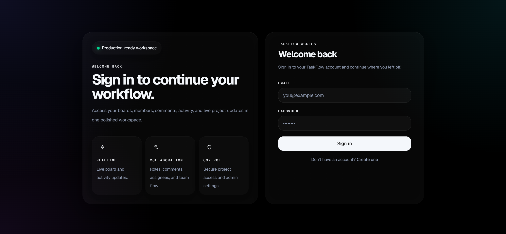
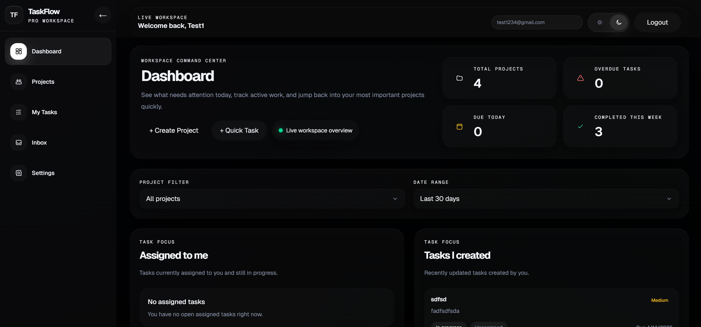
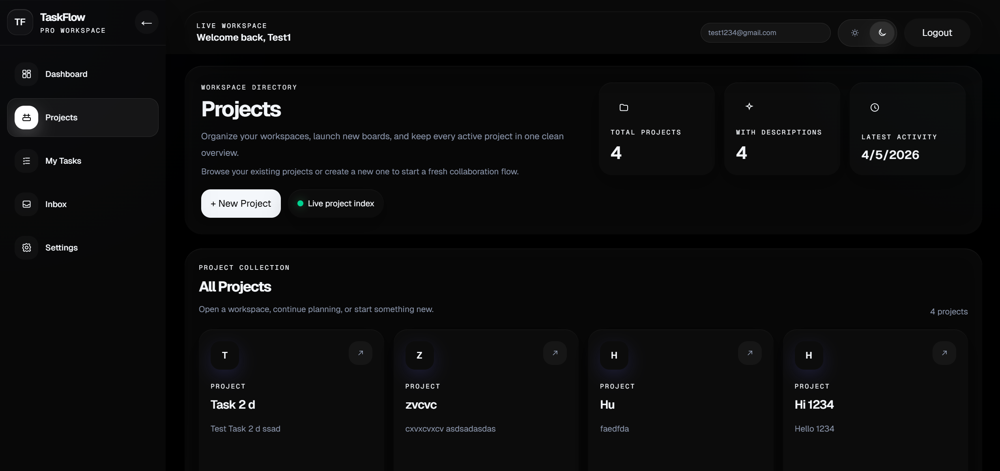
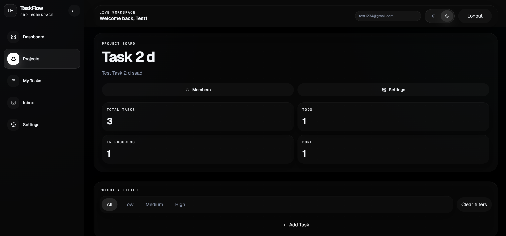
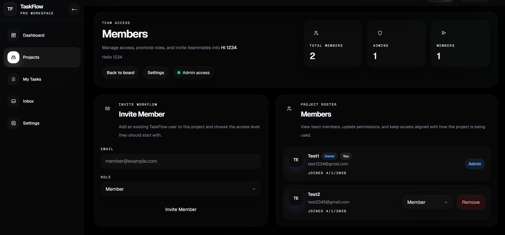
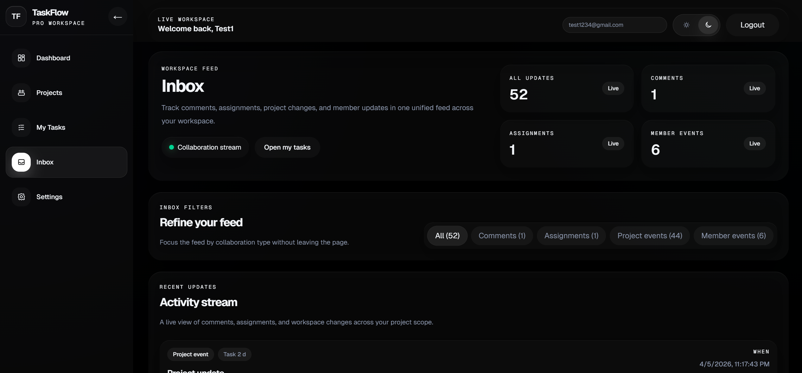

# TaskFlow

TaskFlow is a full-stack collaborative project management application built with Next.js, TypeScript, Redux Toolkit, RTK Query, and Supabase. It provides a modern workspace for teams to organize projects, manage tasks on a Kanban board, collaborate through comments and activity feeds, and control access with role-based permissions.

The application is structured as a production-style Next.js app using the App Router, route handlers for backend APIs, a relational PostgreSQL schema, protected dashboard routes, reusable UI components, and a multi-layer testing setup with Jest, React Testing Library, and Cypress.

---

## Overview

TaskFlow is designed around a typical team workflow:

- authenticate into a protected workspace
- create and manage projects
- invite team members and assign roles
- organize tasks visually across status columns
- update task metadata such as priority, due date, and assignee
- comment on tasks and track project activity
- review workspace insights through dashboard, inbox, and personal task views

The project combines a polished responsive UI with practical application architecture, type-safe data flow, scoped access control, and tested user journeys.

---

## Live Demo

- **Demo:** `ADD_DEPLOYED_LINK_HERE`
- **Demo Credentials:** `ADD_IF_NEEDED`

---

## Key Features

### Authentication and Access
- Email/password sign up and login with Supabase Auth
- Protected dashboard routes
- Redirect away from auth routes for authenticated users
- Logout flow with store cleanup and redirect handling

### Project Management
- Create projects
- View all accessible projects
- Open individual project workspaces
- Update project name and description
- Delete projects
- Project-specific settings page
- Role-aware project settings access

### Team Collaboration
- Invite members to projects
- View project member list
- Change member roles
- Remove members from projects
- Role-based member management controls

### Task Management
- Kanban board with `todo`, `in_progress`, and `done`
- Drag-and-drop task movement using dnd-kit
- Persistent intra-column ordering using `position`
- Create, edit, and delete tasks
- Priority and due date support
- Task assignment to project members only
- Task comments

### Productivity Views
- Dashboard overview with workspace insights
- Completion trend chart
- Status distribution chart
- Workload by member
- Inbox with activity filters
- My Tasks view for user-specific task tracking

### UX and Interface
- Responsive desktop and mobile layout
- Collapsible desktop sidebar
- Portal-based mobile sidebar drawer
- Dark and light mode support
- Glass-style visual system
- Reusable UI patterns and consistent panel styling
- Modal-based task creation and editing flows

### Activity and Audit Visibility
- Project activity feed
- Task movement logging
- Project creation logging
- Task deletion logging
- Scoped access to project activity

---

## Tech Stack

### Core
- **Next.js 16.2.2**
- **React 19.2.4**
- **TypeScript 5**

### Styling and UI
- **Tailwind CSS v4**
- **Framer Motion**
- **clsx**
- **tailwind-merge**
- **next-themes**

### State and Data Fetching
- **Redux Toolkit**
- **RTK Query**
- **react-redux**

### Drag and Drop
- **@dnd-kit/core**
- **@dnd-kit/sortable**
- **@dnd-kit/utilities**

### Backend and Database
- **Supabase**
- **PostgreSQL**
- **@supabase/ssr**
- **@supabase/supabase-js**

### Charts and Insights
- **Recharts**

### Validation and Utilities
- **Zod**

### Testing
- **Jest**
- **React Testing Library**
- **Testing Library User Event**
- **Cypress**

---

## Architecture

TaskFlow uses a single Next.js codebase to serve both frontend pages and backend APIs.

### Frontend
The frontend is built with the App Router and organized into route groups:

- `(auth)` for public authentication pages
- `(dashboard)` for protected application pages

Reusable components are grouped by feature area:
- auth
- board
- dashboard
- inbox
- layout
- projects
- tasks
- theme
- ui

### Backend
Backend functionality is implemented through Next.js route handlers under `app/api`. These routes perform:

- authentication checks
- membership validation
- permission checks
- CRUD operations
- activity logging
- scoped data aggregation

### State Management
Global client state is split into focused Redux slices:

- `authSlice` for user/session state
- `boardSlice` for board task state and filters
- `projectSlice` for project list and active project
- `uiSlice` for modal/sidebar behavior

Server data fetching is handled with RTK Query services:
- `projectsApi`
- `tasksApi`

### Database
Supabase provides authentication and PostgreSQL persistence. Access is reinforced by route-level checks and row-level security support.

---

## Project Structure

```txt
taskflow/
├── __tests__/
│   ├── components/
│   │   ├── BoardColumn.test.tsx
│   │   ├── LoginForm.test.tsx
│   │   └── TaskCard.test.tsx
│   └── store/
│       ├── authSlice.test.ts
│       ├── boardSlice.test.ts
│       └── projectSlice.test.ts
│
├── app/
│   ├── (auth)/
│   │   ├── login/
│   │   │   └── page.tsx
│   │   ├── signup/
│   │   │   └── page.tsx
│   │   └── layout.tsx
│   │
│   ├── (dashboard)/
│   │   ├── dashboard/
│   │   │   └── page.tsx
│   │   ├── inbox/
│   │   │   └── page.tsx
│   │   ├── my-tasks/
│   │   │   └── page.tsx
│   │   ├── projects/
│   │   │   ├── page.tsx
│   │   │   └── [projectId]/
│   │   │       ├── page.tsx
│   │   │       ├── members/
│   │   │       │   └── page.tsx
│   │   │       └── settings/
│   │   │           └── page.tsx
│   │   ├── settings/
│   │   │   └── page.tsx
│   │   └── layout.tsx
│   │
│   ├── api/
│   │   ├── dashboard/
│   │   ├── inbox/
│   │   ├── projects/
│   │   └── tasks/
│   │
│   ├── favicon.ico
│   ├── globals.css
│   ├── layout.tsx
│   └── page.tsx
│
├── components/
│   ├── auth/
│   │   ├── LoginForm.tsx
│   │   └── SignupForm.tsx
│   ├── board/
│   │   ├── BoardColumn.tsx
│   │   ├── BoardFilters.tsx
│   │   ├── KanbanBoard.tsx
│   │   ├── TaskCard.tsx
│   │   └── TaskModal.tsx
│   ├── dashboard/
│   ├── inbox/
│   ├── layout/
│   │   ├── Header.tsx
│   │   ├── ReduxProvider.tsx
│   │   └── Sidebar.tsx
│   ├── projects/
│   ├── tasks/
│   ├── theme/
│   │   ├── ThemeProvider.tsx
│   │   └── ThemeToggle.tsx
│   └── ui/
│       └── GlassSelect.tsx
│
├── cypress/
│   └── e2e/
│       ├── task-delete.cy.ts
│       └── task-flow.cy.ts
│
├── lib/
│   ├── activity.ts
│   ├── project-access.ts
│   ├── supabase-server.ts
│   ├── supabase.ts
│   └── utils.ts
│
├── public/
│   ├── file.svg
│   ├── globe.svg
│   ├── next.svg
│   ├── vercel.svg
│   └── window.svg
│
├── services/
│   ├── api.ts
│   ├── projectsApi.ts
│   └── tasksApi.ts
│
├── store/
│   ├── slices/
│   │   ├── authSlice.ts
│   │   ├── boardSlice.ts
│   │   ├── projectSlice.ts
│   │   └── uiSlice.ts
│   ├── hooks.ts
│   └── index.ts
│
├── types/
│   ├── activity.types.ts
│   ├── api.types.ts
│   ├── auth.types.ts
│   ├── project.types.ts
│   ├── task.types.ts
│   └── index.ts
│
├── .env.local
├── cypress.config.ts
├── eslint.config.mjs
├── jest.config.ts
├── jest.setup.ts
├── next.config.ts
├── package.json
├── proxy.ts
└── tsconfig.json
````

---

## Routing

### Public Routes

* `/`
* `/login`
* `/signup`

### Protected Routes

* `/dashboard`
* `/projects`
* `/projects/[projectId]`
* `/projects/[projectId]/members`
* `/projects/[projectId]/settings`
* `/my-tasks`
* `/inbox`
* `/settings`

The application uses `proxy.ts` to handle route protection and route redirection behavior based on authentication state.

---

## Authentication and Authorization

TaskFlow uses Supabase Auth for identity and a relational membership model for authorization.

### Authentication Behavior

* Unauthenticated users are redirected away from protected routes
* Authenticated users are redirected away from login/signup pages
* The authenticated user is hydrated into Redux on app load
* Logout clears user and related application state

### Authorization Model

Authorization is based on project membership.

A user must belong to a project in order to access:

* project details
* tasks
* activity
* members
* project settings

### Roles

Project roles are defined as:

* `admin`
* `member`

### Admin Capabilities

Admins can:

* update project settings
* delete a project
* manage project members
* assign roles
* perform admin-level project actions

### Member Capabilities

Members can:

* access project data they belong to
* work with allowed task and collaboration flows
* view project settings in restricted mode when they do not have admin access

This role system is enforced in both:

* UI behavior
* API routes

---

## Data Model

TaskFlow uses a relational PostgreSQL schema centered around users, projects, members, tasks, and activity.

### `profiles`

Extends authenticated users with application profile data.

Fields:

* `id`
* `email`
* `full_name`
* `avatar_url`
* `created_at`

### `projects`

Stores each project workspace.

Fields:

* `id`
* `name`
* `description`
* `owner_id`
* `created_at`
* `updated_at`

### `project_members`

Maps users to projects and stores their role.

Fields:

* `id`
* `project_id`
* `user_id`
* `role`
* `joined_at`

### `tasks`

Stores project tasks.

Fields:

* `id`
* `project_id`
* `title`
* `description`
* `status`
* `priority`
* `assignee_id`
* `created_by`
* `due_date`
* `position`
* `created_at`
* `updated_at`

### `project_activity`

Stores scoped project activity events.

Fields:

* `id`
* `project_id`
* `actor_id`
* `action`
* `description`
* `metadata`
* `created_at`

---

## Task Ordering and Drag-and-Drop

Task ordering is persisted through the `position` field in the `tasks` table.

This enables:

* stable task ordering within a column
* correct rendering after refresh
* consistent drag-and-drop behavior
* server-backed task ordering rather than temporary UI-only positioning

Task movement updates:

* `status`
* `position`

This keeps the board durable across sessions.

---

## API Surface

TaskFlow uses Next.js Route Handlers for backend endpoints.

### Dashboard / Workspace APIs

* `GET /api/dashboard/overview`
* `GET /api/inbox`

### Project APIs

* `GET /api/projects`
* `POST /api/projects`
* `GET /api/projects/[projectId]`
* `PUT /api/projects/[projectId]`
* `DELETE /api/projects/[projectId]`

### Member APIs

* `GET /api/projects/[projectId]/members`
* `POST /api/projects/[projectId]/members`
* `PUT /api/projects/[projectId]/members/[memberId]`
* `DELETE /api/projects/[projectId]/members/[memberId]`

### Task APIs

* `GET /api/projects/[projectId]/tasks`
* `POST /api/projects/[projectId]/tasks`
* `PATCH /api/projects/[projectId]/tasks/reorder`
* `PUT /api/tasks/[taskId]`
* `DELETE /api/tasks/[taskId]`

### Comment APIs

* `GET /api/tasks/[taskId]/comments`
* `POST /api/tasks/[taskId]/comments`

### Personal Task APIs

* `GET /api/tasks/my`

### Activity APIs

* `GET /api/projects/[projectId]/activity`

---

## State Management

Redux Toolkit is used for client-side application state, while RTK Query is used for server communication and caching.

### Redux Slices

#### `authSlice`

Handles:

* current user
* auth loading state
* login/logout transitions

#### `boardSlice`

Handles:

* task collection for board interactions
* task movement
* priority and assignee filters

#### `projectSlice`

Handles:

* project list
* active project selection
* project-related loading state

#### `uiSlice`

Handles:

* sidebar visibility
* project modal visibility
* task modal visibility
* editing task context

### RTK Query Services

#### `projectsApi`

Handles:

* project CRUD
* member operations
* activity loading
* dashboard overview
* inbox overview

#### `tasksApi`

Handles:

* project task loading
* task create/update/delete
* task comments
* task reorder
* personal task overview

---

## UI System

TaskFlow uses a consistent design language built around reusable glass-style surfaces and responsive workspace layouts.

Notable UI patterns include:

* `tf-panel`, `tf-panel-soft`, `tf-noise`, and shared utility classes
* reusable theme-aware panels and inputs
* desktop and mobile-specific sidebar behavior
* sticky header layout
* shared modal system for task editing and project actions
* theme toggle with `next-themes`
* charts and metric panels for dashboard reporting

---

## Testing

TaskFlow includes unit, component, and end-to-end testing layers.

### Unit Tests with Jest

Reducer and store logic is tested for predictable state transitions.

Implemented:

* `authSlice.test.ts`
* `boardSlice.test.ts`
* `projectSlice.test.ts`

### Component Tests with React Testing Library

Component-level behavior is tested from the user perspective.

Implemented:

* `LoginForm.test.tsx`
* `TaskCard.test.tsx`
* `BoardColumn.test.tsx`

Covered areas include:

* form rendering and interaction
* keyboard and click behavior
* task card content rendering
* board column rendering and empty-state behavior

### End-to-End Tests with Cypress

Browser-level workflows are tested against the running application.

Implemented:

* `task-flow.cy.ts`
* `task-delete.cy.ts`

Covered flows:

* login
* open project
* create task
* delete task

---

## Available Scripts

### Development

```bash
npm run dev
```

Starts the local development server.

### Build

```bash
npm run build
```

Creates a production build.

### Start

```bash
npm run start
```

Runs the production build locally.

### Lint

```bash
npm run lint
```

Runs ESLint.

### Jest Tests

```bash
npm test
```

Runs all Jest and React Testing Library tests.

### Jest Watch Mode

```bash
npm run test:watch
```

Runs Jest in watch mode.

### Cypress UI

```bash
npm run cypress:open
```

Opens Cypress in interactive mode.

### Cypress Headless

```bash
npm run cypress:run
```

Runs Cypress specs in headless mode.

---

## Getting Started

### 1. Clone the repository

```bash
git clone YOUR_REPOSITORY_URL
cd taskflow
```

### 2. Install dependencies

```bash
npm install
```

### 3. Configure environment variables

Create a `.env.local` file in the project root.

```env
NEXT_PUBLIC_SUPABASE_URL=YOUR_SUPABASE_URL
NEXT_PUBLIC_SUPABASE_ANON_KEY=YOUR_SUPABASE_ANON_KEY
```

### 4. Run the development server

```bash
npm run dev
```

### 5. Open the app

Visit:

```txt
http://localhost:3000
```

---

## Environment Variables

The application currently requires:

```env
NEXT_PUBLIC_SUPABASE_URL=YOUR_SUPABASE_URL
NEXT_PUBLIC_SUPABASE_ANON_KEY=YOUR_SUPABASE_ANON_KEY
```

If additional server-only keys are introduced later, they should remain private and should not be exposed through client-side environment variables.

---

## Local Quality Checks

Recommended local validation flow:

```bash
npm run lint
npm test
npm run build
npm run cypress:run
```

This verifies:

* linting
* reducer and component tests
* production build health
* end-to-end flows

---

## Deployment

TaskFlow is designed to be deployed as a Next.js application with Supabase-backed services.

Typical deployment flow:

1. deploy the app to Vercel
2. set environment variables in the deployment platform
3. verify auth redirects
4. verify protected route access
5. verify project/task/member flows against production

---

## Future Enhancements

Potential next improvements include:

* search across projects and tasks
* richer notifications
* file uploads or attachments
* user avatars and profile media
* member invitation by email flow
* pagination for inbox and activity feeds
* CI pipeline for automated lint/test/build verification
* analytics and reporting expansion
* optimistic UI updates for selected workflows

---

## Screenshots

```md






```

---

## Status

Current implementation includes:

* protected application routing
* project and task management
* member and role management
* dashboard, inbox, and personal task views
* activity logging
* responsive theme-aware interface
* unit, component, and end-to-end tests

---

## License

John Shaize